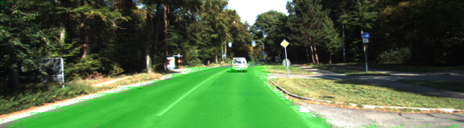
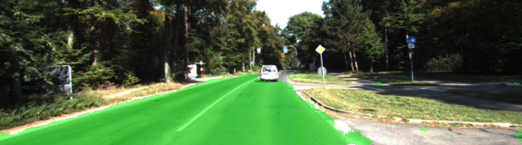
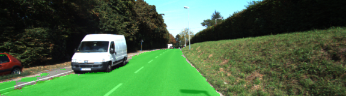
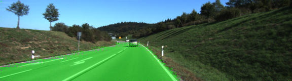
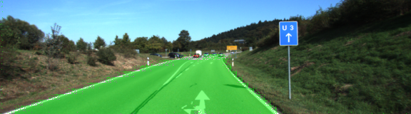
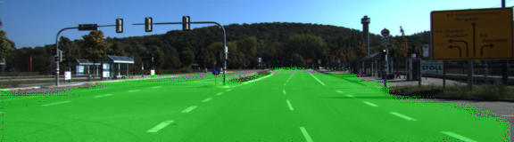
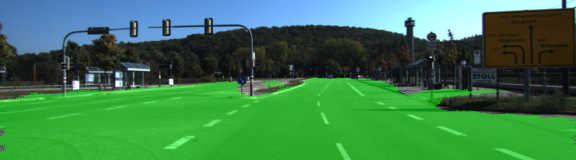
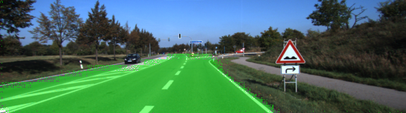

# Semantic Segmentation

[](http://www.udacity.com/drive)


## Architecture

#### Encoder
The encoder for the fully convolutional network is the VGG16 model pretrained on ImageNet for classification. The fully-connected layers are replaced by 1x1 convolutions.

#### Decoder
The decoder portion of the network is achieved by upsampling the input to the original image size. The shape of the tensor after the final convolutional transpose layer will be 4-dimensional: (`batch_size`, `original_height`, `original_width`, `num_classes`).

#### Skip Connections
The final step is to add skip connections to the model. In order to do this we combine the output of two layers (layers 3 and 4, in this case), adding them to lower-level layers (layer 7) upsampled through elementwise addition (`tf.add`).

## Training
The hyperparameters I ended up using for training are:

```
keep_prob: 0.5
learning_rate: 0.0001
epochs: 30
```

As an experiment, I ran the training 2 times, once with a batch size of 5 and once with a batch size of 1. Interestingly, batch size 1 resulted in better mean loss across all epochs, as well as cleaner classification of the pixels as shown in the image samples below.

#### Batch Size: 5
```
Mean Loss for Epoch 0: 7.95103
Mean Loss for Epoch 1: 1.06085
Mean Loss for Epoch 2: 0.80397
Mean Loss for Epoch 3: 0.71278
Mean Loss for Epoch 4: 0.65243
Mean Loss for Epoch 5: 0.59932
...
Mean Loss for Epoch 10: 0.26280
...
Mean Loss for Epoch 20: 0.12230
...
Mean Loss for Epoch 29: 0.07512
```

#### Batch Size: 1
```
Mean Loss for Epoch 0: 2.04790
Mean Loss for Epoch 1: 0.57692
Mean Loss for Epoch 2: 0.30044
Mean Loss for Epoch 3: 0.19735
Mean Loss for Epoch 4: 0.16494
Mean Loss for Epoch 5: 0.14135
...
Mean Loss for Epoch 10: 0.07920
...
Mean Loss for Epoch 20: 0.04489
...
Mean Loss for Epoch 29: 0.04383
```

#### Image Samples

<table>
  <thead>
    <tr>
      <td>1st Run, Batch Size: 5</td>
      <td>2nd Run, Batch Size: 1</td>
    <tr>
  </thead>
  <tbody>
    <tr>
      <td></td>
      <td></td>
    <tr>
    <tr>
      <td></td>
      <td></td>
    <tr>
    <tr>
      <td></td>
      <td></td>
    <tr>
    <tr>
      <td></td>
      <td></td>
    <tr>
    <tr>
      <td></td>
      <td></td>
    <tr>
    <tr>
      <td></td>
      <td></td>
    <tr>
    <tr>
      <td></td>
      <td></td>
    <tr>
    <tr>
      <td></td>
      <td></td>
    <tr>
  </tbody>
</table>

### Setup
##### Frameworks and Packages
Make sure you have the following is installed:
 - [Python 3](https://www.python.org/)
 - [TensorFlow](https://www.tensorflow.org/)
 - [NumPy](http://www.numpy.org/)
 - [SciPy](https://www.scipy.org/)

##### Dataset
Download the [Kitti Road dataset](http://www.cvlibs.net/datasets/kitti/eval_road.php) from [here](http://www.cvlibs.net/download.php?file=data_road.zip).  Extract the dataset in the `data` folder.  This will create the folder `data_road` with all the training a test images.

##### Run
Run the following command to run the project:
```
python main.py
```
**Note** If running this in Jupyter Notebook system messages, such as those regarding test status, may appear in the terminal rather than the notebook.
