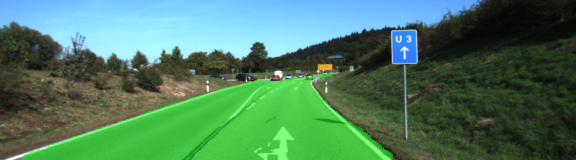
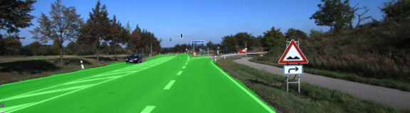

# Semantic Segmentation

[](http://www.udacity.com/drive)

## Work In Progress!

#### Batch Size: 5
```
Mean Loss for Epoch 0: 7.95103
Mean Loss for Epoch 1: 1.06085
Mean Loss for Epoch 2: 0.80397
Mean Loss for Epoch 3: 0.71278
Mean Loss for Epoch 4: 0.65243
Mean Loss for Epoch 5: 0.59932
...
Mean Loss for Epoch 10: 0.26280
...
Mean Loss for Epoch 20: 0.12230
...
Mean Loss for Epoch 29: 0.07512
```

#### Batch Size: 1
```
Mean Loss for Epoch 0: 2.04790
Mean Loss for Epoch 1: 0.57692
Mean Loss for Epoch 2: 0.30044
Mean Loss for Epoch 3: 0.19735
Mean Loss for Epoch 4: 0.16494
Mean Loss for Epoch 5: 0.14135
...
Mean Loss for Epoch 10: 0.07920
...
Mean Loss for Epoch 20: 0.04489
...
Mean Loss for Epoch 29: 0.04383
```

<table>
  <tr>
    <td></td>
    <td></td>
  <tr>
  <tr>
    <td></td>
    <td></td>
  <tr>
  <tr>
    <td></td>
    <td></td>
  <tr>
  <tr>
    <td></td>
    <td></td>
  <tr>
  <tr>
    <td></td>
    <td></td>
  <tr>
  <tr>
    <td></td>
    <td></td>
  <tr>
</table>

### Setup
##### Frameworks and Packages
Make sure you have the following is installed:
 - [Python 3](https://www.python.org/)
 - [TensorFlow](https://www.tensorflow.org/)
 - [NumPy](http://www.numpy.org/)
 - [SciPy](https://www.scipy.org/)

##### Dataset
Download the [Kitti Road dataset](http://www.cvlibs.net/datasets/kitti/eval_road.php) from [here](http://www.cvlibs.net/download.php?file=data_road.zip).  Extract the dataset in the `data` folder.  This will create the folder `data_road` with all the training a test images.

##### Run
Run the following command to run the project:
```
python main.py
```
**Note** If running this in Jupyter Notebook system messages, such as those regarding test status, may appear in the terminal rather than the notebook.
